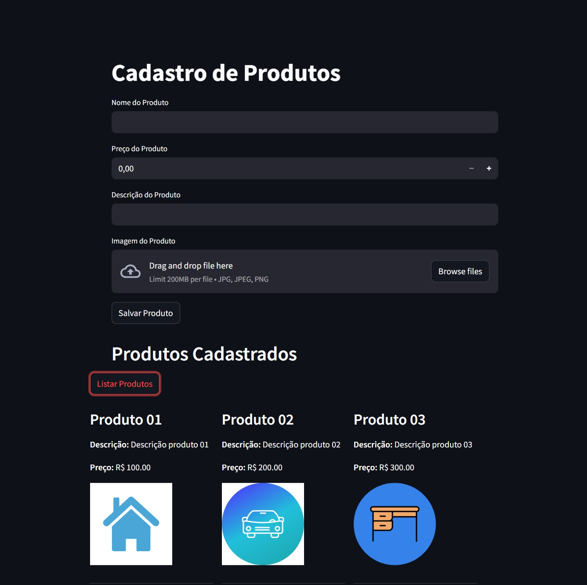

<a href="https://dio.me/">

# Armazenando dados de um E-Commerce na Cloud

 > ℹ️ **NOTE:** Este repositório foi desenvolvido durante o desafio do bootcamp Microsoft Azure Cloud Native, em parceria com a [DIO](https://dio.me)

Narrativa:
  1. Crie um novo repositório no github com um nome a sua preferência
  2. Crie um arquivo chamado readme.md, deixe alguns prints descreva o processo, alguns insights e possibilidades que você aprendeu durante o curso
  3. Compartilhe conosco o link desse repositório através do botão 'entregar projeto'

Durante o desafio, utilizei os conhecimentos adquiridos para criar uma conta na azure cloud, criar SQL Server e database, um pouco de lógica de programação com python.

## 💻 Tecnologias utilizadas no projeto

- [Azure Cloud](https://azure.microsoft.com/pt-br/get-started/azure-portal/)
- [SQL Server](https://learn.microsoft.com/en-us/sql/sql-server/)
- [Python](https://docs.python.org/)

## ✨ Como foi feito ?

### Azure Cloud

1. Criar uma conta no Azure cloud.
2. Crie um resource group e SQL Database:
    - Click no resource group criado;
     - Crie um Azure SQL;
       - Básico single database;
       - Definir Databasename (Salve essa informação vamos precisar adicionar no arquivo `.env`);
       - SQL Development;
       - Click em `Create a new server database`:
         - Defina um nome parar seu server database;
         - Autenticação, marque a opção `Use both SQL and Microsoft Entra authentication`;
         - Click em `Set admin`:
           - Selecione seu usuario principal do Azure Cloud;
           - Crie um usuario local: (Salve essas informações vamos precisar adicionar no arquivo `.env`);
             - Server admin login: seu nome de usuario;
             - Password: sua senha aqui;
             - Confirm Password: sua senha aqui.
          - Click em OK, vai retornar para a tela de `Create SQL Database`;
          - Selecione o Server que acabou de criar;
          - Em Compute + Storage click em `General Purpose - Serverless` > `Configure database`:
            - Vamos utilizar ele como serverless, deixe enable e configure com o minimo, habilitando o `auto-pause`;
            - Aplica.
          - Backup storage redundancy: `Locally-redundancy backup storage`;
          - Click em `Review + Create`
          - Click em `Create`;  
3. Criar um storage account
   - Enquanto está criando nosso banco, volte no Resource Group criado e click em create;
   - Vamos criar um Storage Account, click em create:
     - Defina um nome para sua storage account (Salve essas informações vamos precisar adicionar no arquivo `.env`);
     - Primary service definir `Azure Blob Storage or Data Lake Storage`;
     - Performance: `Standart`;
     - Redundancy: `Locally-redundancy storage`;
   - Click em `Review + Create`;
   - Antes de criar click em `Advanced`:
     - Marque a opção:
       - `Allow enabling anonymous access on individual containers`
   - Click em `Review + Create`;
   - Click em `Create`.
4. Criar o container
   - Navegue para seu Resource Group;
   - Acesse sua Storage Account:
     - Acesse Data Storage;
     - Containers:
       - Crie um container e defina o nome como: `fotos` (Salve essa informação vamos precisar adicionar no arquivo `.env`);
       - Em Anonymous access level: `Blob (Anonymous read access for blobs only)` ;
       - Click em `Create`
    - Ainda em Storage Account, click em `Security + networking` > `Access Keys` > `Show Connections String`;
    - Copie a string (Salve essa informação vamos precisar adicionar no arquivo `.env`);

5. Connection String SQL Database
   - Navegue para seu Resource Group;
   - Acesse sua SQL Database:
     - Click em Show database connection strings:
       - Copie o trecho em destaque:
         - Server=tcp:`yoursqldatabase.database.windows.net,1433` (Salve essa informação vamos precisar adicionar no arquivo `.env`);

6. Habilitar o firewall
  - Navegue para seu Resource Group;
  - Acesse seu SQL Server:
     - Click em `Secutiry > Networking > Public Access`
       - Click em `Selected networks`
       - Em firewall rules click em `Add your client IPV4 address`;
       - Isso vai adicionar permissão para acesso ao banco da sua maquina.
  - Para testar a conexão utilize o SQL Server Management Studio, outra opção mais leve e rápido seria o HeidiSQL;
  - Aproveite e crie a nossa tabela:
    - Execute o sql abaixo:
      ~~~sql
        CREATE TABLE Produtos (
          id INT IDENTITY(1,1) PRIMARY KEY,
          nome NVARCHAR(255),
          descricao NVARCHAR(MAX),
          preco DECIMAL(18,2),
          imagem_url NVARCHAR(2083)
        )
      ~~~

### Python

* Necessário python instalado;
* Utilizei o VS Code para a criação do código.

1. Informações `.env`
   - Vamos adicionar as informações que coletamos nas etapas anteriores:
   ~~~python
    BLOB_CONNECTION_STRING = "suaconnectionstring"
    BLOB_CONTAINER_NAME = "fotos"
    BLOB_ACCOUNT_NAME = "seunomedostorageaccount"

    SQL_SERVER = "suaconnectionstringsqldatabase"
    SQL_DATABASE = "seudatabasename"
    SQL_USER = "seuusernamesql"
    SQL_PASSWORD = "suapasswdsql"
   ~~~

## 🛠️ Instruções de execução

- Abra o arquivo main.py:
- Antes de executar nosso projeto é necessário instalar as dependencias:
   - Execute no terminal:
     ~~~python
     pip install -r requirements.txt
     ~~~
- Caso tenha realizado todos os passos acima e adicionado todas as informações corretas no arquivo `.env`.
   - Execute no terminal o comando:
     ~~~python
     streamlit run main.py
     ~~~

## 🚀 Resultados
Este desafio proporcionou uma experiência prática de como criar alguns serviços na Azure Cloud. Criar um código em python e utilizar os serviços criados na Azure Cloud.

## 👨‍💻 Expert

    
    
&nbsp&nbsp&nbspFelipe M Ferreira 
    &nbsp&nbsp&nbsp
    <a href="https://github.com/felipeb2a">
    GitHub</a>&nbsp;|&nbsp;
    <a href="https://www.linkedin.com/in/felipe-marques-ti/">LinkedIn</a>
&nbsp;|&nbsp;
    <a href="https://www.instagram.com/felipeb2a/">
    Instagram</a>
&nbsp;|&nbsp;

  

---

⌨️ com 💜 por [Felipe M Ferreira](https://github.com/felipeb2a)